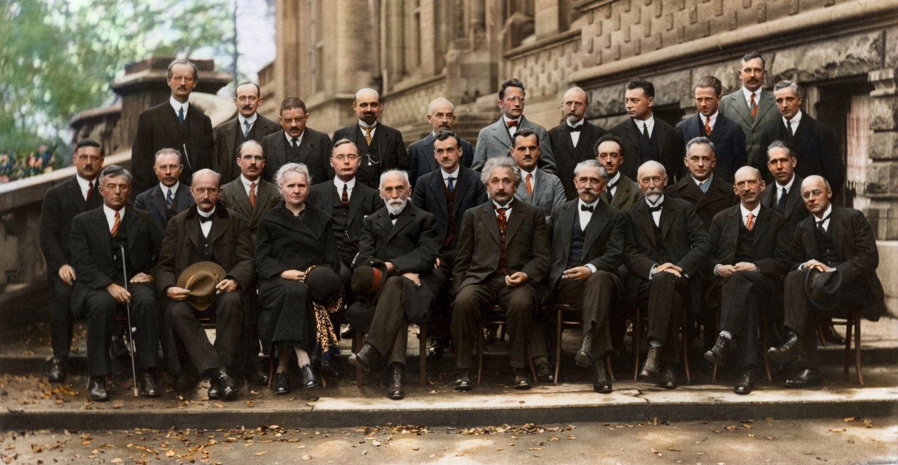

## Welcome to GitHub Pages: brettlv's blog
 

+ 
<a itemprop="sameAs" content="https://orcid.org/0000-0001-8879-368X" href="https://orcid.org/0000-0001-8879-368X" target="orcid.widget" rel="noopener noreferrer" style="vertical-align:top;">brettlv_orcid</a>
 
+ News_Blog [wixsite](https://brettlv.wixsite.com/brettlv/)
+ Read_Blog [ReadtheDocs](http://brettlvgithubio.readthedocs.io/en/latest/)
+ Sphinx_Site [Website](/build/index.html)
+ My_Git [Repro](https://github.com/brettlv/brettlv.github.io/)
+ Jupyter_code [Viewer](http://nbviewer.jupyter.org/github/brettlv/brettlv.github.io/tree/master/pythoncode/)
+ Home_Page [Github](https://brettlv.github.io/)
+ QQEmail 

+ [radiolearnnote](./radiolearnnote)
+ [pythoncode](./pythoncode)
+ [build](./build/README.html)
+ [source](./source/README.md)

